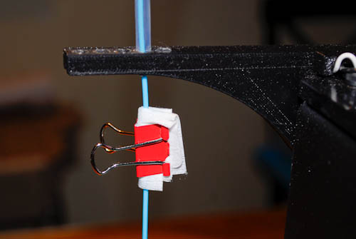
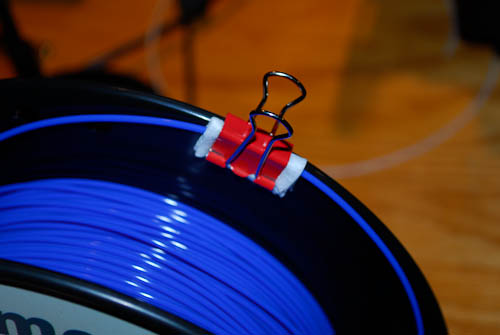

# 3D-printer
Resources, information, lessons learned, configuration files, and any other useful items for the HRVIP MakerGear M2 3D printer

Preventative Measures
=====================

To avoid needing to perform any of the maintenance actions listed below, follow these simple steps to make life easier:
- Keep workspace clean and dust-free.
- If you can't guarantee a clean environment, focus on keeping the PLA clean by mounting a wipe to it (see below).
- Don't let PLA sit in a hot nozzle for a long time. Hot PLA may dissolve and burn onto the inside of the nozzle, creating a clog or partial clog.
- Regularly clean the extruder, either with compressed air or by removing it and brushing the gears.
- Regularly check the zero height of the nozzle since the bed level adjustment screws have been known to shift from vibration (a dab of hot glue can keep them in place)

Printer Maintenance
===================

PLA Handling
------------
PLA is water absorbent and must be stored in a sealed bag with desiccant to prevent ruination.
When not in use: store in bag
When in use: consider covering or building a sealed container to allow it to feed while still remaining relatively dry vs. the environment

_**How to tell your PLA is bad:**_

Clean, brand-new PLA will be highly reflective, smooth to the touch, and will bend nearly 180° before breaking
Ruined PLA will have a dull sheen, be rougher to the touch, and will snap at a smaller angle.
If you receive a brand new spool that is contaminated, contact MakerGear support directly and they will replace it.

_**Tangled PLA spools:**_

PLA spools can tangle when the end of the thread crossed underneath a spooled thread.
This usually happens just after the end is removed from the printer.
A tangled PLA spool can cause significant physical damage to the machine.
[This video](https://www.youtube.com/watch?v=lE9LchCtKL4) will illustrate how to untangle and unknot your spool if this happens.
Use binder clips and clean paper towels/wipes to prevent tangling in the future, as illustrated in [this MakerGear Forum thread](http://forum.makergear.com/viewtopic.php?f=11&t=2772&p=17361#p17361) and in the images below:

 

Clogged Nozzle
--------------

Dust and debris can get lodged in the nozzle and reduce, skew, or wholly prevent easy and consistent extrusion.
Use the **‘Cold Pull’** method described in [this MakerGear article](https://makergear.zendesk.com/hc/en-us/articles/115005186283-The-Cold-Pull-Nozzle-Cleaning-Method) to clean the nozzle (you may have to repeat this procedure several times).
Old PLA can cause similar symptoms since it absorbs water (see above), which will in turn vaporize inside the nozzle and form bubbles which will resist extrusion.
Only replace the nozzle if the Cold Pull method does not work (assuming PLA is good).
**DO NOT INSERT ANY FOREIGN OBJECT IN THE NOZZLE IN ATTEMPT TO UNCLOG.**
Doing so may physically scratch or otherwise damage the nozzle, resulting in poor performance, or worse, introduce even more debris.

Replacing Filament
------------------

It's suggested that you perform a ‘Cold Pull’ (AKA 'atomic method') every time you remove and replace the filament.
Note that for our printer, the [**V4 Filament Drive**](https://www.makergear.com/collections/parts/products/filament-drive) (the structure surrounding the feed gear) is slightly misaligned from the feed hole of the [**V4 Hot End**](https://www.makergear.com/collections/parts/products/hot-end) (the top of the V4 Hot End extruder).

If the new filament does not feed directly into the V4 Hot End and instead strikes to the side, you will need a flat, dull tool to gently push the filament and make it align it with the nozzle feed hole.
A flat head screwdriver or plastic scraping tool is usually sufficient.
Once the filament is properly aligned, it will not require any more outside guidance.
[This video](https://www.youtube.com/watch?v=Ni7xN4616No) from the MakerGear official YouTube channel is a tutorial for swapping filament.

Replacing Hot End Assembly
---------------------------
The Makergear M2 uses a [**V4 Hot End**](https://www.makergear.com/products/hot-end) ($85.00) to heat and deposit the filament.
The Hot End consists of several components:
- [Cartridge Heater](https://www.makergear.com/products/cartridge-heater) (heating element, $20.00)
- [Thermistor](https://www.makergear.com/products/thermistor) (temperature sensor, $20.00)
- Heater Block Assembly:
  - [Barrel](https://www.makergear.com/products/v4-barrel) ($25.00)
  - [Heater Block](https://www.partsbuilt.com/v4-heater-block-makergear/) (not sold by Makergear, $35.00)
- [Fiberglass Insulation ](https://www.makergear.com/products/insulation) ($2.50)
- [V4 Nozzle](https://www.makergear.com/products/nozzle)
 
Any maintenance performed on the Hot End will first require you to remove the Hot End from the printer.
Use [this guide provided by Makergear](https://makergear.zendesk.com/hc/en-us/articles/115005730183-V4-Hot-End-Removal-and-Installation-) to ensure a safe removal of the V4 Hot End.
This guide is written for the Makergear M3 but applies equally well to the M2.
The steps are summarized below:
1. Removing the filament using the **‘Cold Pull’** method described in [this MakerGear article](https://makergear.zendesk.com/hc/en-us/articles/115005186283-The-Cold-Pull-Nozzle-Cleaning-Method).
2. Allow the Hot End to cool to a comfortable handling temperature.
3. Turn off the power supply
4. Disconnect the 2-pin heater power connector and the 2-pin thermistor connector. Note that these connectors have opposite genders to make it impossible to reconnect them improperly.
5. Loosen the Hot End clamping screw using a 3mm (?) hex key.
6. Pull the Hot End directly down and out of the mounting plate. The tolerance is tight, so some slight rotation (or a flathead screw to gently pry the clamp open wider) may be necessary.

Installation is opposite of removal.
Note that when the Hot End is reinstalled, you will be required to readjust the Z-axis zero, either by adjusting the bed height or adjusting the hard stop screw.
Generally, adjusting the bed height is easier as long as all three screws are rotated by the same amount.

Replacing V4 Nozzle
-------------------
A clogged nozzle is a fairly common cause of printer errors.
While the risk of clogs can be mitigated through care and cleanliness, it is nevertheless going to be an inevitable cause of problems.
Use [this guide provided by Makergear](https://makergear.zendesk.com/hc/en-us/articles/115005694286-Removing-and-Installing-The-V4-Nozzle) to ensure a safe removal of the V4 Nozzle.
Be sure to follow the steps to properly remove the V4 Hot End from the mounting plate before attempting to replace the nozzle.

When printing with PLA exclusively, you may attempt to clean a nozzle by submerging it in 

Bed Leveling
------------
Three adjustment screws underneath the bed control bed level.
The screws are laid out in an isosceles triangle formation, with the longest side parallel to the Y-axis and running down the center of the build plate.
Adjusting one screw will result in the platform rotating about a line formed by the other two screws.
Keep this geometry in mind when adjusting the platform.
Together, these three screws control three degrees of freedom (2 in rotation, 1 in translation) of the build plate.
“Roll” (Rotation about the Y-axis, which runs “front to back” when facing the printer), “Pitch” (Rotation about the X-axis, which runs “left to right” when facing the printer), and vertical height (Z).

Bed leveling is a time-consuming process and may take upward of 1-2 hours if you’re just learning, so plan accordingly.
It will get faster with practice.
Use the process outlined in [this video](https://www.youtube.com/watch?v=haoTCmkF5to) to go about properly leveling the bed.

When properly leveled and zeroed, the nozzle should sit between 0.0 and 0.1 mm above the bed.
This distance can be crudely measured by using a sheet of printer paper (called "the paper test") as outlined in the previously-linked video.

**NOTE 1:**
The adjustment screws tend to shake themselves loose, especially when the printer is performing lots of fast, short movements which induce a large high-frequency vibration mode. 
Use a dab of hot glue on the screw heads (after they are adjusted to their desired position) to keep them in place.
This glue can be easily peeled away if future adjustments are necessary.

**NOTE 2:**
If the bed is level but the zeroed Z-axis distance is incorrect, you can do one of two things:
- Raise/Lower the entire bed by adjusting all three bed leveling screws by the same amount (preferred)
- Raise/Lower the Z hard-stop screw (not recommended)

Print Settings
A configuration file is available which will specify the bed size and print speeds/temperatures. This is only a starting point -- you will need to adjust the settings as needed based on the geometry of your print.
Layer Heights
Curved features generally require smaller layer heights.
Structural features should use smaller layer heights (increases inter-layer adhesion)
Adaptive layer height is a good feature to use and provides good customizability
Min layer height: 0.1mm
Max layer height: 0.3mm
40% infill for non-structural parts
100% infill for structural parts
Temperature
Bed temperature: 70°C
Nozzle temperature: 220°C (If using older spool, raise to ~230°C)
Support Structures
Max speed: 30 mm/s
Suggested pattern: honeycomb
Pattern spacing: 1mm
Overhang: 30%

